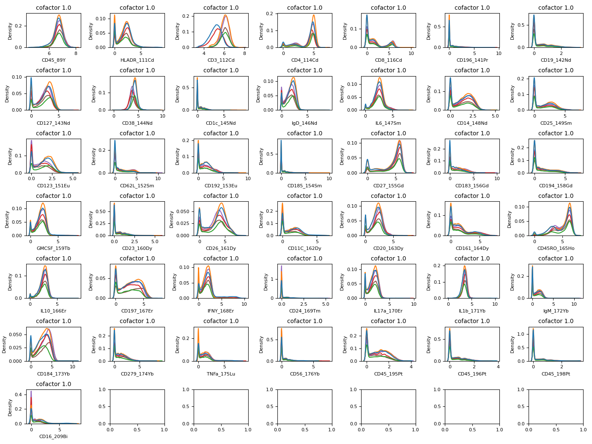
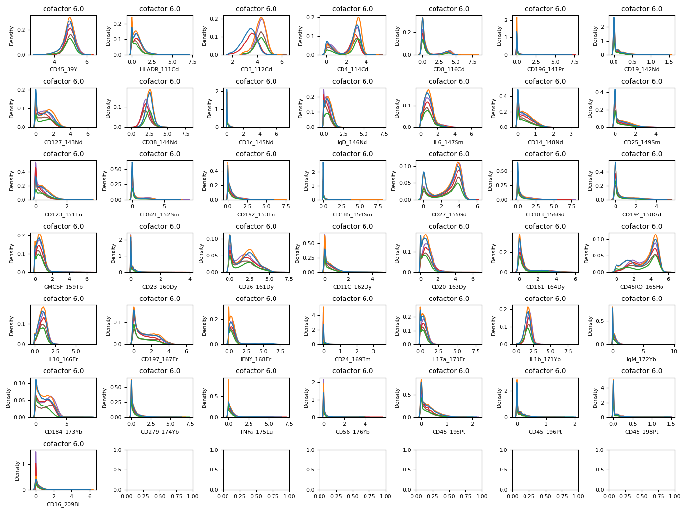

# CyTOF: read fcs files and test cofactors
MKim

    '/sfs/gpfs/tardis/project/iprime_storage/myles_kim/FCS_analysis'

    
    

        
        Loading BokehJS ...
    

    Unable to display output for mime type(s): application/javascript, application/vnd.bokehjs_load.v0+json

# Reading fcs files in a directory

    [Sample(v3.0, Tet2_194_CD3_CD28.fcs, 71 channels, 30562 events),
     Sample(v3.0, Tet2_194_LPS.fcs, 71 channels, 33507 events),
     Sample(v3.0, Tet2_194_VEH.fcs, 71 channels, 14994 events),
     Sample(v3.0, Tet2_205_CD3_CD28.fcs, 71 channels, 23737 events),
     Sample(v3.0, Tet2_205_LPS.fcs, 71 channels, 28403 events),
     Sample(v3.0, Tet2_205_VEH.fcs, 71 channels, 18004 events)]

# all fcs data combined as a DataFrame

<table class="dataframe" data-quarto-postprocess="true" data-border="1">
<thead>
<tr style="text-align: right;">
<th data-quarto-table-cell-role="th"></th>
<th data-quarto-table-cell-role="th">Time</th>
<th data-quarto-table-cell-role="th">Event_length</th>
<th data-quarto-table-cell-role="th">CD45_89Y</th>
<th data-quarto-table-cell-role="th">102Pd</th>
<th data-quarto-table-cell-role="th">104Pd</th>
<th data-quarto-table-cell-role="th">105Pd</th>
<th data-quarto-table-cell-role="th">106Pd</th>
<th data-quarto-table-cell-role="th">108Pd</th>
<th data-quarto-table-cell-role="th">110Pd</th>
<th data-quarto-table-cell-role="th">HLADR_111Cd</th>
<th data-quarto-table-cell-role="th">...</th>
<th data-quarto-table-cell-role="th">208Pb</th>
<th data-quarto-table-cell-role="th">CD16_209Bi</th>
<th data-quarto-table-cell-role="th">Center</th>
<th data-quarto-table-cell-role="th">Offset</th>
<th data-quarto-table-cell-role="th">Width</th>
<th data-quarto-table-cell-role="th">Residual</th>
<th data-quarto-table-cell-role="th">beadDist</th>
<th data-quarto-table-cell-role="th">bc_separation_dist</th>
<th data-quarto-table-cell-role="th">mahalanobis_dist</th>
<th data-quarto-table-cell-role="th">sample_id</th>
</tr>
</thead>
<tbody>
<tr>
<td data-quarto-table-cell-role="th">0</td>
<td>661.041992</td>
<td>22.0</td>
<td>412.645020</td>
<td>25.777630</td>
<td>840.156738</td>
<td>62.351097</td>
<td>621.207642</td>
<td>35.149330</td>
<td>663.321167</td>
<td>3.907504</td>
<td>...</td>
<td>0.000000</td>
<td>2.712706</td>
<td>665.995483</td>
<td>63.749474</td>
<td>41.665462</td>
<td>99.399338</td>
<td>146.214340</td>
<td>0.427387</td>
<td>2.119524</td>
<td>Tet2_194_CD3_CD28.fcs</td>
</tr>
<tr>
<td data-quarto-table-cell-role="th">1</td>
<td>1606.848999</td>
<td>30.0</td>
<td>86.169205</td>
<td>19.263371</td>
<td>754.377319</td>
<td>63.770561</td>
<td>702.919067</td>
<td>34.960449</td>
<td>615.405823</td>
<td>17.882900</td>
<td>...</td>
<td>0.039206</td>
<td>0.574640</td>
<td>1014.872131</td>
<td>83.073563</td>
<td>74.469383</td>
<td>120.216301</td>
<td>84.530914</td>
<td>0.421493</td>
<td>2.356081</td>
<td>Tet2_194_CD3_CD28.fcs</td>
</tr>
<tr>
<td data-quarto-table-cell-role="th">2</td>
<td>2134.166992</td>
<td>27.0</td>
<td>235.820526</td>
<td>43.977959</td>
<td>682.236694</td>
<td>61.585442</td>
<td>506.093597</td>
<td>29.748413</td>
<td>420.823425</td>
<td>22.905087</td>
<td>...</td>
<td>0.107103</td>
<td>1.655213</td>
<td>1008.516785</td>
<td>116.714310</td>
<td>89.460983</td>
<td>135.712341</td>
<td>155.546814</td>
<td>0.357073</td>
<td>2.992274</td>
<td>Tet2_194_CD3_CD28.fcs</td>
</tr>
<tr>
<td data-quarto-table-cell-role="th">3</td>
<td>2726.041992</td>
<td>34.0</td>
<td>401.721039</td>
<td>17.634621</td>
<td>486.760681</td>
<td>45.908226</td>
<td>421.965057</td>
<td>32.385147</td>
<td>372.157776</td>
<td>18.211843</td>
<td>...</td>
<td>0.000000</td>
<td>0.000000</td>
<td>1193.339722</td>
<td>84.541939</td>
<td>87.027130</td>
<td>153.430710</td>
<td>123.058891</td>
<td>0.387981</td>
<td>1.092942</td>
<td>Tet2_194_CD3_CD28.fcs</td>
</tr>
<tr>
<td data-quarto-table-cell-role="th">4</td>
<td>3270.702881</td>
<td>26.0</td>
<td>340.457306</td>
<td>21.509212</td>
<td>665.266113</td>
<td>50.862789</td>
<td>549.097961</td>
<td>21.249895</td>
<td>520.453430</td>
<td>4.582990</td>
<td>...</td>
<td>2.780666</td>
<td>0.446503</td>
<td>871.395264</td>
<td>84.206436</td>
<td>65.056786</td>
<td>101.099045</td>
<td>139.366653</td>
<td>0.431778</td>
<td>2.244912</td>
<td>Tet2_194_CD3_CD28.fcs</td>
</tr>
</tbody>
</table>

5 rows × 72 columns

# trimmed channels that are not used

<table class="dataframe" data-quarto-postprocess="true" data-border="1">
<thead>
<tr style="text-align: right;">
<th data-quarto-table-cell-role="th"></th>
<th data-quarto-table-cell-role="th">CD45_89Y</th>
<th data-quarto-table-cell-role="th">HLADR_111Cd</th>
<th data-quarto-table-cell-role="th">CD3_112Cd</th>
<th data-quarto-table-cell-role="th">CD4_114Cd</th>
<th data-quarto-table-cell-role="th">CD8_116Cd</th>
<th data-quarto-table-cell-role="th">CD196_141Pr</th>
<th data-quarto-table-cell-role="th">CD19_142Nd</th>
<th data-quarto-table-cell-role="th">CD127_143Nd</th>
<th data-quarto-table-cell-role="th">CD38_144Nd</th>
<th data-quarto-table-cell-role="th">CD1c_145Nd</th>
<th data-quarto-table-cell-role="th">...</th>
<th data-quarto-table-cell-role="th">IgM_172Yb</th>
<th data-quarto-table-cell-role="th">CD184_173Yb</th>
<th data-quarto-table-cell-role="th">CD279_174Yb</th>
<th data-quarto-table-cell-role="th">TNFa_175Lu</th>
<th data-quarto-table-cell-role="th">CD56_176Yb</th>
<th data-quarto-table-cell-role="th">CD45_195Pt</th>
<th data-quarto-table-cell-role="th">CD45_196Pt</th>
<th data-quarto-table-cell-role="th">CD45_198Pt</th>
<th data-quarto-table-cell-role="th">CD16_209Bi</th>
<th data-quarto-table-cell-role="th">sample_id</th>
</tr>
</thead>
<tbody>
<tr>
<td data-quarto-table-cell-role="th">0</td>
<td>412.645020</td>
<td>3.907504</td>
<td>78.869453</td>
<td>0.064539</td>
<td>45.691082</td>
<td>3.176548</td>
<td>0.000000</td>
<td>3.065427</td>
<td>17.981371</td>
<td>1.267487</td>
<td>...</td>
<td>2.797745</td>
<td>5.964279</td>
<td>2.519733</td>
<td>0.423804</td>
<td>0.622348</td>
<td>2.881647</td>
<td>0.000000</td>
<td>0.0</td>
<td>2.712706</td>
<td>Tet2_194_CD3_CD28.fcs</td>
</tr>
<tr>
<td data-quarto-table-cell-role="th">1</td>
<td>86.169205</td>
<td>17.882900</td>
<td>96.898453</td>
<td>0.000000</td>
<td>36.989292</td>
<td>0.000000</td>
<td>0.000000</td>
<td>0.126138</td>
<td>26.494999</td>
<td>0.000000</td>
<td>...</td>
<td>0.646155</td>
<td>0.039602</td>
<td>0.018124</td>
<td>84.315346</td>
<td>1.118604</td>
<td>3.115852</td>
<td>2.533583</td>
<td>0.0</td>
<td>0.574640</td>
<td>Tet2_194_CD3_CD28.fcs</td>
</tr>
<tr>
<td data-quarto-table-cell-role="th">2</td>
<td>235.820526</td>
<td>22.905087</td>
<td>35.147606</td>
<td>38.417339</td>
<td>0.718573</td>
<td>0.000000</td>
<td>1.577704</td>
<td>2.337688</td>
<td>5.960651</td>
<td>0.000000</td>
<td>...</td>
<td>0.000000</td>
<td>0.667073</td>
<td>11.242700</td>
<td>0.941599</td>
<td>0.012648</td>
<td>1.672839</td>
<td>0.748688</td>
<td>0.0</td>
<td>1.655213</td>
<td>Tet2_194_CD3_CD28.fcs</td>
</tr>
<tr>
<td data-quarto-table-cell-role="th">3</td>
<td>401.721039</td>
<td>18.211843</td>
<td>168.439880</td>
<td>4.329476</td>
<td>181.127151</td>
<td>0.000000</td>
<td>1.589560</td>
<td>3.125704</td>
<td>32.871078</td>
<td>0.000000</td>
<td>...</td>
<td>7.390351</td>
<td>34.851997</td>
<td>2.578116</td>
<td>3.053176</td>
<td>0.000000</td>
<td>0.000000</td>
<td>0.111948</td>
<td>0.0</td>
<td>0.000000</td>
<td>Tet2_194_CD3_CD28.fcs</td>
</tr>
<tr>
<td data-quarto-table-cell-role="th">4</td>
<td>340.457306</td>
<td>4.582990</td>
<td>103.852966</td>
<td>50.595531</td>
<td>0.000000</td>
<td>0.000000</td>
<td>0.000000</td>
<td>9.441140</td>
<td>8.959432</td>
<td>0.000000</td>
<td>...</td>
<td>0.667570</td>
<td>140.122437</td>
<td>0.000000</td>
<td>4.926303</td>
<td>0.758325</td>
<td>0.010309</td>
<td>0.000000</td>
<td>0.0</td>
<td>0.446503</td>
<td>Tet2_194_CD3_CD28.fcs</td>
</tr>
</tbody>
</table>

5 rows × 44 columns

    (149207, 44)

# Make marker density plots with various cofactors

## With a cofactor = 1.0

## With a cofactor = 6.0

